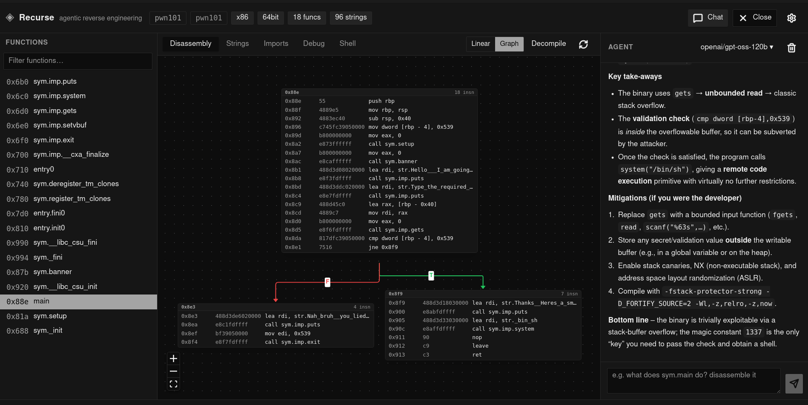

# Recurse

Agentic reverse engineering environment — a Ghidra-class desktop app in the spirit of
"Cursor for reverse engineering". Built with **Tauri 2** (React + TypeScript frontend) on top
of an existing RE toolchain: **[radare2](https://rada.re/n/)** does all parsing, analysis,
disassembly, xrefs, strings and imports; **r2ghidra** (optional) provides decompilation.



## Repository layout

Cargo workspace at the root; the desktop app is one package in it.

```
tauri/                   desktop app (Tauri + React)
  src/                     React frontend
  src-tauri/               Tauri Rust backend (r2 sessions, agent wiring)
  package.json             app scripts (Vite, Vitest, Tauri CLI)
crates/
  librecurse/              agent framework: LLM loop, tool runtime, SQLite memory
  recurse-eval/            headless eval harness (YAML-configured tiers)
justfile                 single entry point for both halves
```

`librecurse` has no Tauri dependency and builds/tests standalone; `recurse-eval`
drives it headlessly. All three are workspace members, so one `Cargo.lock` and one
`target/` cover the whole repo.

## Features

- Cursor-style workspace: function list, disassembly/strings/imports tabs, CFG graph,
  and a chat agent sidebar (toggle with the Chat button or `Ctrl+L`)
- Grounded agent: every address is a clickable object (function list, graph nodes,
  xrefs, decompiler annotations) — not pasted text that the model can hallucinate
- Live analysis session on any binary — including extension-less files
- Persistent project memory in SQLite with FTS5/BM25 retrieval — renames, findings
  and notes survive `/clear` and reopen, and seed the next session
- Headless core (`librecurse`) with per-turn debug tracing; the same agent loop runs
  in the UI and in the eval harness
- LLM agent backed by an OpenAI-compatible endpoint (OpenRouter by default) with a
  model picker; drives the session directly (disasm, xrefs, strings, imports, decompile)
- Dark-first UI built with Tailwind CSS v4 + shadcn/ui

## Why not just MCP-to-IDA / yolo it in Claude Code?

Stapling an MCP server onto IDA/Ghidra, or pasting `r2` output into a CLI agent,
works for 5-function CTFs and falls apart on real binaries. Recurse is a
purpose-built environment, not a chatbot wrapper:

- **Binary world-model, not text scraping.** Functions, xrefs, strings and the CFG
  are first-class state shared by the agent and the UI. No re-parsing
  `pdF` dumps into context every turn, no invented `0x401023`s.
- **Verification > generation.** In RE there is no `npm test` — verification is
  visual. Agent renames propagate to the function list, graph and decompile
  instantly, so a human confirms or rejects in one click.
- **Built for scale.** Real malware is 10k functions. Demand-driven tools +
  persistent memory beat dumping full decompiles until context OOMs.
- **Agentable engine.** IDA is single-threaded, license-locked and headless-hostile.
  radare2 is free, scriptable and pipeable — agents can run 100 turns, fork,
  reset and diff. And you can actually ship it.
- **Malware-safe by default.** Local-first, BYO-key/OpenRouter routing, and a path
  to offline models — no forced exfil of samples to a cloud chatbot.

## Prerequisites

### 1. Core toolchains

| Tool     | Version (tested)   | Install                                                                 |
| -------- | ------------------ | ----------------------------------------------------------------------- |
| Node.js  | ≥ 20 (23.11 used)  | https://nodejs.org or `nvm`                                              |
| npm      | ≥ 10               | ships with Node.js                                                       |
| Rust     | ≥ 1.77 (1.97 used) | https://rustup.rs                                                         |
| cargo    | —                  | ships with Rust (rustup)                                                  |

Verify:

```bash
node --version && npm --version && rustc --version && cargo --version
```

### 2. radare2 (analysis engine)

`r2` must be on `PATH`. **Build from source** (recommended) — distro packages are often
outdated and incompatible with the r2pm plugin registry (see r2ghidra below):

```bash
# 1. Clone and install the latest radare2
git clone https://github.com/radareorg/radare2
cd radare2
./sys/install.sh

# 2. Confirm the install
r2 -v
```

> **Compatibility:** Recurse targets **radare2 6.x** (tested on **6.2.1**).

For a quick non-recommended option, distro packages also exist:

```bash
sudo apt install -y radare2
```

### 3. Tauri Linux system dependencies

Debian/Ubuntu/Pop!_OS:

```bash
sudo apt update
sudo apt install -y libwebkit2gtk-4.1-dev build-essential \
  curl wget file libxdo-dev libssl-dev libayatana-appindicator3-dev librsvg2-dev
```

Other distros: follow the official
[Tauri prerequisites](https://v2.tauri.app/start/prerequisites/).

### 4. r2ghidra (optional — decompiler view)

If the previous step failed (e.g. the `r2pm` registry couldn't find plugins), it's because
the distro `radare2` is too old — rebuild from source as above, then install the plugin:

```bash
# From the radare2 repo directory (must be on the latest radare2 built from source):
r2pm -i          # update / initialize the plugin registry
r2pm -ci r2ghidra
```

Without it, the Decompile tab surfaces a graceful error; everything else works.

## Build

App dependencies live in `tauri/`; Rust comes from the workspace root. `just` wraps
both (see `just --list`), or drive them directly.

### Development

```bash
just dev
# equivalent: cd tauri && npm install && npm run tauri dev
```

This starts the Vite dev server and launches the Tauri window. First compile takes a
while (Rust build); subsequent ones are fast.

### Production binary

```bash
just build
# equivalent: cd tauri && npm run tauri build
```

The bundle lands in `target/release/bundle/` (workspace target):

- `.deb` / `.rpm` / `.AppImage` for Linux
- standalone binary at `target/release/recurse`

### Just the frontend (no desktop shell)

```bash
just preview
# equivalent: cd tauri && npm run build && npm run preview
```

## Quality checks

```bash
just lint        # cargo clippy --workspace + eslint
just fmt         # cargo fmt --all + prettier
just fmt-check   # verify without writing
just test        # cargo test --workspace + vitest
```

Equivalent direct commands: `cargo clippy --workspace --all-targets`,
`cargo test --workspace` at the root; `npm run lint` / `npm run format` /
`npm run build` inside `tauri/`.

## Evals

The agent is evaluated headlessly against crackme tiers (see
[`crates/recurse-eval/README.md`](crates/recurse-eval/README.md)). Tiers are YAML:
selection filters over the dataset, or a frozen hexid list, plus run knobs.

```bash
just eval-fetch   # download the tier's binaries
just eval-test    # harness self-tests (no API key needed, no LLM calls)
just eval-run     # run the tier — the only way to execute an eval YAML
```

`eval-run` is a binary, not a test, so `cargo test` never spends money or time on
the agent. Endpoint + key go in `crates/recurse-eval/.env` (copy `.env.example`).
Each run writes `target/eval-traces/<tier>/run.log` (the full narrative) plus one
`<hexid>.json` per task with the complete per-turn conversation.

## Agent LLM

The agent chat panel runs on an OpenAI-compatible endpoint. Configure the API key and
model from the in-app model picker (persisted in `~/.recurse/recurse.db`), or via env:

```bash
export RECURSE_LLM_API_KEY=sk-or-...   # or OPENROUTER_API_KEY
export RECURSE_LLM_ENDPOINT=https://openrouter.ai/api/v1/chat/completions  # optional
export RECURSE_LLM_MODEL=openrouter/auto  # optional
```

Without credentials it falls back to an echo client so the wiring stays exercisable.

The agent sees live binary context (arch, bits, type) and can drive any radare2
command (disassembly, xrefs, strings, imports, decompilation) through the session.

## License

[MIT](./LICENSE) — © 2026 Aayush Khanna